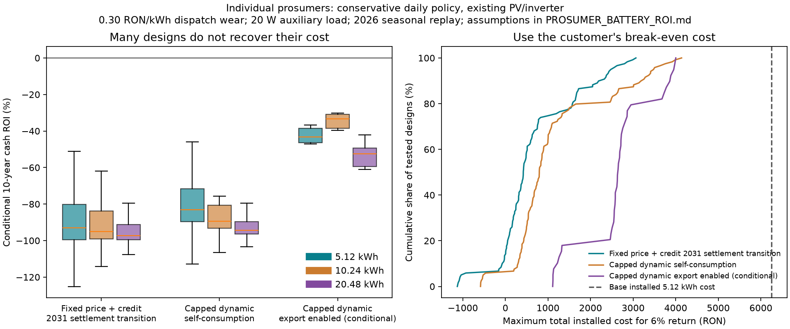

# A battery owned by one prosumer: profitability across Romanian networks

## Status: excluded from the product

Decision, 5 October 2026: GridLink will not offer personal battery purchases to prosumers. The study and reproduction files are retained as evidence for that decision. Shared community storage remains the battery option, with its [analysis and conditional ROI](CONSUMER_BACKTEST.md#shared-community-results). The findings below describe the tested investment scenarios; they do not establish that a personal battery can never be profitable.

Checked and computed on **5 October 2026**. All money is in **RON**, including VAT where applicable. The investment is a battery added to existing PV, serving one owner's billing meter. Existing panels are excluded from battery capital cost.

**The earlier research covered both individual households and shared storage. Its strongest result, about 2.38-year payback, was for four homes and 20 kWp of PV behind one billing meter. That result does not transfer to a battery bought by one household.** The earlier individual 5.15-year solar payback also used an illustrative wholesale-linked export contract, rather than standard Romanian prosumer compensation. See [the original comparison](CONSUMER_BACKTEST.md).

The fresh analysis is much less favourable at the published equipment prices. In the main matrix, none of **840 investment designs** recover their investment in ten years. A sensitivity that permits overnight storage, knows the entire coming week and applies no marginal wear penalty finds a few cases with **positive ten-year cash ROI**, up to **+11.0%**. Even those cases have negative net present value at a 6% discount rate.

These results support the decision to exclude personal battery purchases from GridLink's offering. Lower installed cost, an existing compatible inverter, sufficient surplus and a confirmed export contract can change an individual investment's economics. The calculations below document those sensitivities as research.

## What was tested

The production battery solver was reused. It now accepts explicit interval import/export prices so the research can model fixed export credits, capped imports and export floors consistently in dispatch and billing. The frontend retains its existing illustrative contract settings; this research does not activate real battery control or configure a supplier contract.

| Dimension | Cases |
|---|---|
| Demand | Five measured OPSD / CoSSMic residential profiles, transferred to Romanian local clock hours without scaling |
| Distribution | Four distributors, represented by eight service areas and cities |
| Existing PV | 3, 5 and 10 kWp per owner |
| Nominal storage | 5.12, 10.24 and 20.48 kWh |
| Main contracts | Fixed supply with active-energy export credit; capped dynamic supply/export offer |
| Regulatory sensitivity | Separate dispatch after quantitative compensation ends, using monthly PZU export prices |
| Export sensitivity | Stored-energy export enabled, at 5 kWp, conditional on contract and connection permission |
| Calendar | January, April, July and 1–28 September 2026: 120 Romanian dates |
| Information | Actual historical prices, measured transferred demand and ERA5-based PV are known in advance |

The source is [OPSD Household Data, version 2020-04-15](https://data.open-power-system-data.org/household_data/2020-04-15/). The original parser reconstructs gross demand where PV exists, rejects missing/interpolated meter feeds and keeps complete 24-hour days. Details and attribution are in [CONSUMER_BACKTEST.md](CONSUMER_BACKTEST.md). These are German measurements replayed under Romanian conditions; they are not a representative Romanian household survey.

| Profile | Matched dates | Measured mean demand | Extrapolated annual demand |
|---|---:|---:|---:|
| Residential 2 | 120 | 7.06 kWh/day | 2,570 kWh |
| Residential 3 | 120 | 15.09 kWh/day | 5,496 kWh |
| Residential 4, including fixed EV/heat-pump demand | 120 | 16.02 kWh/day | 5,785 kWh |
| Residential 5 | 120 | 6.93 kWh/day | 2,512 kWh |
| Residential 6 | 68 | 24.95 kWh/day | 9,265 kWh |

Annual values first average daily outcomes within each sampled month, then equally across the four months. The last profile has sparse April/July coverage, so its annual projection is less reliable. Each design receives equal weight in comparisons; results are not weighted by Romanian household prevalence. The same five profiles are reused across regions, which allows location comparisons but does not create thousands of independent customers.

### Regional prices and weather

Prices are collected OPCOM quarter-hour observations averaged to hourly intervals. The Romanian PZU price series is common to all locations. Distribution charges and local PV production vary. The tariff annex in [Hidrofix, October 2026](https://cdn.hidroelectrica.ro/cdn/furnizare/2026/30_09/oferta_tip_casnic_hidrofix_c2-0110-3110-26.pdf) supplies the low-voltage distribution charges; these are component prices before VAT.

| Representative location | Distributor / service area | Distribution charge, RON/kWh | Modelled annual output from 5 kWp |
|---|---|---:|---:|
| Bucharest | Rețele Electrice / Muntenia | 0.31739 | 6,311 kWh |
| Timișoara | Rețele Electrice / Banat | 0.31739 | 6,429 kWh |
| Constanța | Rețele Electrice / Dobrogea | 0.31739 | 6,508 kWh |
| Ploiești | DEER / Muntenia Nord | 0.35534 | 6,118 kWh |
| Brașov | DEER / Transilvania Sud | 0.35534 | 5,955 kWh |
| Cluj-Napoca | DEER / Transilvania Nord | 0.35534 | 5,920 kWh |
| Iași | Delgaz Grid | 0.38791 | 5,746 kWh |
| Craiova | Distribuție Oltenia | 0.33325 | 6,499 kWh |

These production figures are **four-season extrapolations**, not annual measured yields. [Open-Meteo's ERA5 historical weather](https://open-meteo.com/en/docs/historical-weather-api) provides each city's hourly radiation. The model uses horizontal irradiance × PV capacity × 0.8, limited by nominal capacity. Radiation recorded at the following hour is aligned to the preceding price interval. Roof orientation, shading, module temperature, inverter clipping details and voltage-related disconnections are not calibrated. Temperature/weather observations are retained in the regional CSV, but battery thermal derating is not simulated.

Higher distribution charges can increase the value of avoiding grid imports. Local weather changes the timing and quantity of surplus. The table is not a ranking of where to install batteries: the tested roof and household assumptions still dominate the decision.

## Contract rules change the return

### Fixed supply and quantitative compensation

The explicit prosumer clause of [VIITOR HIDRO, October 2026](https://cdn.hidroelectrica.ro/cdn/furnizare/2026/30_09/oferta_tip_casnic_viitor_hidro_c3-0110-3110.pdf) states **0.515 RON/kWh active energy, excluding TG**, and an identical active-energy purchase price for eligible exports up to 200 kW. This differs from the headline offer for customers who are not prosumers. The model credits exports at 0.515 and adds TG, network charges, contributions, excise and VAT to imports. The reconstructed full import price ranges from **1.18766 RON/kWh in Rețele areas to 1.27298 in Delgaz**. Current charges are applied to historical usage; these are tariff scenarios rather than historical invoices.

[Law 160/2026](https://www.senat.ro/Legis/Lista.aspx?cod=25551), published on 23 July, specifies active-energy compensation and excludes supply/imbalance components and network/tax items from the export settlement price. Quantitative compensation lasts through **31 December 2030**; the [adopted text, Article 73¹(9)](https://www.senat.ro/legis/PDF/2023/23L504FP.PDF?nocache=true) points to the monthly PZU sale mechanism afterwards. This does not mean a solar export cancels the entire future retail import charge.

The ten-year fixed-contract projection therefore uses 4.25 years of current compensation from an assumed 1 October 2026 commissioning date, followed by a monthly-PZU export scenario. For the fifth investment year, one quarter uses current compensation and three quarters use the later scenario. Import energy prices are held at the reference value; future tariff/legislative changes are not predicted.

| Month used as future export-price proxy | Published PZU volume-weighted mean |
|---|---:|
| January 2026 | 0.79041 RON/kWh |
| April 2026 | 0.51465 RON/kWh |
| July 2026 | 0.63646 RON/kWh |
| September 2026 | 0.91736 RON/kWh |

Sources: [OPCOM January market report](https://www.opcom.ro/uploads/doc/rapoarte/lunar/R_2601_RO.pdf), [April report](https://www.opcom.ro/uploads/doc/rapoarte/lunar/R_2604_RO.pdf), [OPCOM monthly announcements](https://www.opcom.ro/anunturi-stiri-pp/ro/1). These observed monthly averages are **not forecasts for 2031**. The September average covers the full month; the hourly replay stops on 28 September. We use the actual published volume-weighted means, not arithmetic averages of the sampled hours.

The [ANRE transitional-methodology publication of 21 September](https://anre.ro/proiect-de-ordin-privind-stabilirea-unor-masuri-tranzitorii-pentru-aplicarea-mecanismului-de-compensare-cantitativa-in-cazul-contractelor-de-vanzare-cumparare-a-energiei-electrice-aflate-in-derulare-2/) and the [multi-location methodology publication](https://anre.ro/proiect-de-ordin-pentru-aprobarea-metodologiei-privind-regulile-de-comercializare-facturare-decontare-si-alocare-valorica-multi-loc-aplicabile-prosumatorilor-faza-a-ii-a/) are draft consultations, with comments due 1 October. They are not proof that a new payment workflow is operational. The replay values each export credit fully when earned. It does not simulate credit balances, delayed payment or expiry. Accordingly, the financial figures are cash-equivalent bill-value projections, rather than observed money collected in a bank account.

### A published capped dynamic prosumer offer

The [YellowGrid / GAN ENERGY September–November offer](https://www.yellowgrid.ro/api/cms-file?name=oferta-agregare-si-furnizare-pret-dinamic-pcccp05-05-final.pdf&url=https%3A%2F%2Fprod-ro-website-cms.yellowgrid.ro%2Fmedia%2F5eojupyt%2Foferta-agregare-si-furnizare-pret-dinamic-pcccp05-05-final.pdf) provides a concrete alternative for prosumers with its controller and smart metering. The simulation interprets its formulas, with `p` in RON/kWh, as:

```text
import active-energy price = min(0.55, 0.1375 + 0.75 × p)
export payment            = max(0.50, 0.1250 + 0.75 × p)
full import price         = 1.21 × (active price + quoted regulated charges)
```

The variable supply commission is already in the first formula; the illustrative annex's 0.05 supply row is not added again. That annex uses TSS 0.01470, whereas the Hidroelectrica annex uses 0.01272. Both quoted versions are preserved. The offer assigns fiscal obligations for qualifying natural persons below 100 kW to the administrator. Other legal deductions and exact invoice interpretation must be confirmed in the actual agreement.

**The financial terms apply for three months.** Holding them constant for a ten-year projection is conditional. Controller cost is unquoted and excluded; assuming an existing controller makes its cost common to the battery/no-battery comparison. A new connection to the service needs that extra cost added.

Two dispatch cases use these prices. The conservative case discharges only for the owner's demand. The export-enabled case can sell stored energy and may charge from the grid. The latter requires an expressly suitable contract, permission for the battery and approved export capacity; it is an opportunity test, not a claim that every prosumer can earn those payments. Battery-origin energy must be eligible for the quoted remuneration. The law's recognition of stored-energy sales does not by itself establish an owner's commercial settlement terms.

### Why storing solar does not save the full retail price

For one kWh diverted from a solar export, at 90% round-trip efficiency:

```text
cash benefit     = 0.90 × later avoided import price − current export payment
dispatch benefit = cash benefit − 0.90 × wear allowance
```

In Bucharest's fixed reference, this is approximately `0.90 × 1.18766 − 0.515 = 0.554 RON` before wear/auxiliary consumption. With the main wear policy it becomes about **0.284 RON per kWh charged**. The other 0.515 RON was already available from exporting the solar; it is not a new battery benefit.

On a capped dynamic tariff, an expensive wholesale evening does not necessarily produce an equally expensive retail import: the cap can remove most of the import-arbitrage incentive. An export contract can still reward that high market price. This is why import caps, export payments and battery-export permission must be represented separately.

## Equipment cost and financial accounting

[PowerSense currently lists the Deye 5.12 kWh module from 4,750.21 RON including VAT, without installation](https://powersense.ro/baterie-deye-se-g5-1-pro-b/). The word “from” matters: configuration, availability, delivery and an installed quote can differ. Installation below is an assumption, not a published installer quote. Existing inverter compatibility is assumed.

| Battery | Operating energy window, 10–100% SOC | Equipment | Assumed installation | Base investment |
|---|---:|---:|---:|---:|
| 5.12 kWh | 4.608 kWh DC | 4,750 RON | 1,500 RON | **6,250 RON** |
| 10.24 kWh | 9.216 kWh DC | 9,500 RON | 1,500 RON | **11,000 RON** |
| 20.48 kWh | 18.432 kWh DC | 19,001 RON | 1,500 RON | **20,501 RON** |

The battery round-trip efficiency is 90%; power is 2.5 kW for one module and 5 kW for the larger cases. Grid limits are 15 kW import and 10 kW export, sufficient for the replayed measured peaks. Assumed incremental auxiliary consumption is **20 W continuously**, or 175.2 kWh/year before any storage losses. It enters the physical load of battery cases and is absent from the no-battery baseline. Actual equipment could use more or less.

The main dispatch penalty is **0.30 RON per AC kWh discharged**, with 0.15 and zero tested separately. It influences which cycles are chosen. It is **not subtracted again** from investment cash flows: initial capital pays for the battery, while those flows use energy-bill savings before the noncash penalty. Financial projections also assume 100 RON/year operating cost, 2% annual savings fade, a ten-year evaluation horizon, a 6% discount rate, no financing, no inflation/escalation, no salvage value and no base-case replacement.

```text
first-year net benefit = annual energy-bill saving − 100 RON
first-year cash return = first-year net benefit / installed investment
simple payback        = installed investment / first-year net benefit
10-year cash ROI      = (total projected net benefit − investment) / investment
NPV at 6%             = discounted projected net benefit − investment
```

The simple-payback ratio holds the first-year benefit constant. It can suggest recovery beyond the assumed equipment horizon and ignore the 2030 transition; use the stored year-by-year projection for the investment decision. Positive ten-year cash ROI is weaker than positive NPV at 6%.

The [manufacturer datasheet](https://deye.com/wp-content/uploads/2026/01/deye-se-g5.1-pro-b-series_brochure-20260115auv1.0.pdf) specifies a ten-year conditional warranty and a 16 MWh/module throughput reference at 70% end-of-life capacity; its cycle test has specified temperature/rate/depth conditions. The seven-day test's extrapolated discharge reaches that throughput reference after roughly ten years or longer. This is not a guaranteed service life or a substitute for the actual warranty and temperature restrictions.

For constant capped-contract terms, annual bill savings needed to reach zero NPV at 6%, with the stated fade and operating cost, are approximately **1,028 RON for 5.12 kWh, 1,727 RON for 10.24 kWh, and 3,125 RON for 20.48 kWh**. This is a useful screening threshold before buying hardware.

## Main results: daily schedules with a conservative wear policy

Each fixed/self-use row covers **120 investment designs**: eight cities × five demand profiles × three PV sizes. Each export row covers **40 designs** at 5 kWp. Counts include several battery sizes for the same owner scenario; they are not counts of different people.

| Contract / dispatch | Battery | Mean annual bill-value saving before annual OPEX | Saving as share of baseline gross import spend | Median ten-year cash ROI | Designs with positive NPV at 6% |
|---|---:|---:|---:|---:|---:|
| Fixed + compensation, including 2031 transition | 5.12 | 306 RON | 8.77% | −92.9% | 0/120 |
| Fixed + compensation, including 2031 transition | 10.24 | 350 RON | 10.03% | −95.1% | 0/120 |
| Fixed + compensation, including 2031 transition | 20.48 | 350 RON | 10.05% | −97.3% | 0/120 |
| Capped dynamic, self-use | 5.12 | 276 RON | 8.00% | −83.0% | 0/120 |
| Capped dynamic, self-use | 10.24 | 316 RON | 9.15% | −89.5% | 0/120 |
| Capped dynamic, self-use | 20.48 | 316 RON | 9.16% | −94.4% | 0/120 |
| Capped dynamic, export enabled — conditional | 5.12 | 492 RON | 14.03% | −43.3% | 0/40 |
| Capped dynamic, export enabled — conditional | 10.24 | 852 RON | 24.32% | −33.3% | 0/40 |
| Capped dynamic, export enabled — conditional | 20.48 | 1,050 RON | 29.96% | −52.4% | 0/40 |

The percentage column divides summed annualised savings by summed annualised gross import expenditure. It is **not a conventional reduction of the net bill**. Some baseline days already earn a net credit, which makes averaging daily net-bill percentages misleading. The annual saving column includes auxiliary consumption but precedes the 100 RON operating expense. For fixed tariffs it describes the current first-year settlement; ten-year ROI also includes the later settlement scenario.

At 5.12 kWh, annual savings range from **−29 to 743 RON** on the fixed reference and **22 to 717 RON** on capped self-use. Across all three capacities, increasing storage commonly adds little saving because surplus and suitable later demand are exhausted. A positive operating saving does not imply a positive investment return.

With 5 kWp and 5.12 kWh, current annual savings by area are:

| City | Fixed + export credit | Capped dynamic self-use | Capped dynamic export enabled |
|---|---:|---:|---:|
| Bucharest | 285 RON | 259 RON | 477 RON |
| Timișoara | 273 RON | 250 RON | 480 RON |
| Constanța | 317 RON | 281 RON | 494 RON |
| Ploiești | 320 RON | 294 RON | 504 RON |
| Brașov | 327 RON | 299 RON | 509 RON |
| Cluj-Napoca | 306 RON | 279 RON | 491 RON |
| Iași | 318 RON | 296 RON | 493 RON |
| Craiova | 285 RON | 263 RON | 486 RON |

These are equal-weight means of the five profiles in each city. The differences do not turn the ordinary purchase into an attractive investment at the base costs.

Consumption timing makes a larger difference. At the same 5 kWp/5.12 kWh sizing, capped self-use saves about **582 RON/year** for profile 3, but only **240 RON** for profile 4 and **178 RON** for the highest-demand profile 6, averaged across locations. Profile 4 consumes slightly more annually than profile 3. Annual consumption alone therefore cannot select the right battery: the relevant quantities are surplus when charging and deficits when discharging. EV/heat-pump loads remain fixed in this replay.

Mean cash-improving daily rates are approximately **77.0% fixed, 73.9% capped self-use and 77.8% capped export**, at 5.12 kWh. Days with an idle battery can still lose money against no battery through auxiliary consumption. These are known-information replay outcomes, not real-world forecast success rates, and exclude allocating annual OPEX to individual days.



## Check that daily resets are not hiding the opportunity

The main replay starts and ends each day at the 10% reserve. That misses yesterday's solar serving today's morning load. We therefore performed a separate test that carries state of charge across **up to seven consecutive days**, ending at the starting reserve only at block boundaries. Dataset gaps are never joined.

This test also removes the dispatch wear penalty and knows the coming week's prices, demand and PV exactly. It is deliberately optimistic about scheduling information and cycling. Auxiliary consumption, round-trip losses, annual fade and operating cost remain. It covers **40 designs per row**, across all eight locations and five profiles, at the stated sizing.

| Seven-day opportunity test | Mean annual saving | Median ten-year cash ROI | Cash ROI range | Positive cash ROI | Positive NPV at 6% |
|---|---:|---:|---:|---:|---:|
| Fixed, 5 kWp / 5.12 kWh, including later settlement | 449 RON | −68.3% | −92.6% to −35.6% | 0/40 | 0/40 |
| Capped self-use, 10 kWp / 5.12 kWh | 520 RON | −46.3% | −62.9% to +2.8% | 2/40 | 0/40 |
| Capped export, 5 kWp / 5.12 kWh | 623 RON | −20.2% | −59.0% to −4.9% | 0/40 | 0/40 |
| Capped export, 5 kWp / 10.24 kWh | 1,140 RON | −9.2% | −56.4% to +11.0% | 8/40 | 0/40 |

One favourable export-enabled example is **Ploiești, profile 3, existing 5 kWp, 10.24 kWh storage**. Its optimistic annual saving is **1,444 RON**, first-year net benefit **1,344 RON**, first-year cash return **12.2%**, constant-benefit simple payback **8.18 years**, and projected payback after fade **8.91 years**. Its ten-year cash ROI is **+11.0%**, but NPV at 6% is **−1,920 RON**. The maximum installed cost for zero NPV is approximately **9,081 RON**, versus the assumed 11,000 RON. With savings 25% lower, cash ROI becomes **−19.0%**.

This is evidence that a single prosumer's battery *can* recover its nominal cost in favourable circumstances. It is not evidence of robust profitability across most owners, nor an achievable forecast-performance claim. Seven-day future information is unavailable to a live controller; longer-horizon results are an opportunity sensitivity, not an implemented forecasting system.

The separate daily wear tests also check whether 0.30 RON/kWh was too cautious. At 5 kWp/10.24 kWh with export enabled, reducing the penalty to 0.15 increases mean annual savings from **852 to 976 RON**; removing it entirely gives **1,008 RON**. None of those daily cases has positive ten-year cash ROI at the full base price. Overnight carry helps more than merely cycling more aggressively in that subset.

## What would make more owners profitable?

### Lower owner cost and select the right participants

The maximum financially acceptable **total installed owner cost** is the discounted ten-year benefit. Compare this against the complete quote, including inverter changes, controller, installation, protection equipment and fees. A negative maximum means the modelled benefit does not even cover the annual operating cost.

| Design group | Median maximum owner cost at 6%, conservative daily policy | Optimistic seven-day median, selected sizing |
|---|---:|---:|
| Fixed, 5.12 kWh | 420 RON across all PV sizes | 1,585 RON at 5 kWp |
| Capped self-use, 5.12 kWh | 796 RON across all PV sizes | 2,499 RON at 10 kWp |
| Capped export, 5.12 kWh | 2,639 RON at 5 kWp | 3,712 RON at 5 kWp |
| Capped export, 10.24 kWh | 5,462 RON at 5 kWp | 7,433 RON at 5 kWp |

The two columns differ in both scheduling assumptions and, where stated, PV selection. Their medians are not a matched estimate of forecast improvement. The best optimistic capped self-use case accepts about **4,784 RON** for a 5.12 kWh installation; the best optimistic export-enabled 10.24 kWh case accepts about **9,081 RON**. These maxima leave no buffer for model error.

A hypothetical **50% reduction in total owner investment** makes the 10.24 kWh export-enabled subset more interesting. With the daily 0.15 wear policy, **32/40 designs, or 80%, have positive NPV at 6%**, and median ten-year cash ROI becomes approximately **+56.5%**. The same 50% cost reduction combined with **25% lower savings** leaves only **7/40, or 17.5%,** above zero NPV. The optimistic seven-day variant also reaches 32/40 at half cost, falling to 11/40 with that savings stress.

This is a cost scenario, **not confirmation of an available grant**, and the percentages refer to this particular tested subset. It shows why discounted hardware or a subsidy can create a viable offer, but a large majority is not robustly profitable once reasonable performance uncertainty is included.

### Inverter compatibility and contract payments

Adding an assumed **6,000 RON inverter retrofit** worsens every main investment result. An existing grid-tied PV system does not automatically have a battery-compatible inverter. Avoid recommending a retrofit from annual kWh alone. A quoted premium system, extra reserve for backup, or recurring software fees also need their own rerun; these costs are absent from the base case.

A community or aggregator could pay the owner for availability or dispatch, in addition to the energy-bill benefit. Using the conservative main medians, a constant extra **net payment of roughly 741 RON/year** for the 5.12 kWh capped self-use design, or **752 RON/year** for the 10.24 kWh export-enabled design, closes the 6% NPV gap. These are required payments calculated from the gap, not researched offers or assumed revenue. Someone must fund them from verified community savings or a contracted service. Energy income already counted in the replay cannot be counted again as an aggregation bonus.

For separately metered community members, a battery at one house does not automatically avoid another house's retail/network charges. The owner needs a real remuneration and allocation agreement. The prototype's adjustable trading price and 50/50 transport split redistribute payments; they do not themselves establish a battery return or remove regulated charges. A supplier/aggregator contract, settlement boundaries and each participant's alternative tariff must be evaluated. See [the PV-farm/apartment study](PV_FARMS_AND_APARTMENTS.md).

### Choose the tariff and flexible load before the battery

All battery returns above compare battery/no battery under **the same contract**. Supplier switching can save money without storage. In this matrix, the capped offer's no-battery annual net cost is often lower than the fixed reference; averaged over the matched small-battery designs, the fixed reference is about **287 RON/year** above the cheaper of the two no-battery contract models. A new controller/service cost can reduce that difference. Do not label savings from a tariff switch as battery ROI.

Moving an EV's charging or other flexible demand to solar hours uses PV without storage losses or battery capital. For one kWh of otherwise exported solar, direct use saves `import price − export payment`; storing it saves `0.9 × import price − export payment`, before wear/auxiliary costs. Smart scheduling can therefore improve the total bill while reducing the economically justified stationary battery size. EV charging optimisation does not require a stationary battery. Rescheduling was not included in these numerical results.

## Local weather, national shortages and stored-energy sales

The price history already contains market scarcity and renewable-production effects. Local weather estimates the owner's PV surplus; the optimiser can preserve exports when the price is more attractive than storing that energy. Export-enabled cases also test shifting stored energy to more valuable hours, after the modelled commission, losses and import charges.

A national-weather forecast can help beyond the horizon of published prices if it predicts renewable supply and price changes well enough. **No extra forecasting profit is credited here.** We use actual prices and local reanalysis, rather than forecasts issued before dispatch. The [earlier weather experiment](CONSUMER_BACKTEST.md) found 8.06% no-solar bill savings with local weather versus 7.92% with local plus coastal weather on the same eligible cases. That did not establish a reliable additional national-weather advantage. A capacity-weighted national solar/wind forecast, issued-weather archive, load forecast and contemporaneous meter data are still needed to measure it.

For a capped import contract, national scarcity may chiefly matter through the export payment. For a fixed active-energy export credit, a high hourly PZU price does not automatically increase the owner's payment. The optimiser should act on the actual settlement formula. When prices are already published, use those prices; a weather-based price estimate should not replace an available market observation.

## Practical recommendation for GridLink

Use a per-owner screening workflow that compares **no battery, tariff switching, flexible consumption, and each storage size** against the best attainable total bill. Ask for a full installed quote and the actual import/export agreements. Use at least a full year of that owner's demand/PV where possible, connection limits, inverter compatibility, reserve needs and auxiliary power. Return the installed-cost ceiling and a stressed NPV alongside simple payback.

The promising candidates in this sample have an existing compatible inverter, significant correctly timed surplus/deficits, confirmed paid battery exports or a low owner purchase cost. Start with the smallest useful capacity for ordinary self-consumption. The 10.24 kWh option becomes a stronger candidate in the export-enabled subset. The 20.48 kWh option adds too little benefit to justify its cost in these tests. Smaller/cheaper battery products were not simulated; any proposed alternative needs its own efficiency, power, installed quote and warranty inputs.

For a broad rollout, aim to lower the customer's total bill first. Offer batteries only when the specific case passes a conservative financial threshold. Offer advisory scheduling and collect meter/forecast performance before asking owners to buy equipment on the strength of retrospective results. Backup reliability has value, but it should be a separately stated purchase objective; no invented backup income is included in these returns.

## Files, checks and reproduction

The main matrix completed **131,520 validated daily schedules**. Wear sensitivities added **43,840 validated daily schedules**. The overnight test checked **3,480 multi-day blocks covering 21,920 meter-day replays**. All passed energy balance, SOC, power, grid operating-mode and equal-final-charge checks at the appropriate horizon. Together they represent **197,280 meter-day replays** of a small reused cohort, not that many independent observed days. All **13 backend automated tests passed**, including contract-price dispatch/billing and the 2030 financial transition.

| File | Purpose |
|---|---|
| [backtest_prosumers.py](backtest_prosumers.py) | Main matrix, real-offer formulas, cost assumptions, financial projections and chart |
| [prosumer-designs.csv](prosumer-designs.csv) | Readable per-design results for filtering by location, profile, PV, battery and contract |
| [prosumer-backtest.json](prosumer-backtest.json) | Full main summaries, annual cash flows, retrofit/replacement/savings sensitivities, input SHA-256 |
| [prosumer-backtest-days.csv.gz](prosumer-backtest-days.csv.gz) | Compressed daily main-case evidence |
| [check_prosumer_wear.py](check_prosumer_wear.py), [prosumer-wear.json](prosumer-wear.json) | Matched 0.15/zero dispatch-wear sensitivities |
| [check_prosumer_horizon.py](check_prosumer_horizon.py), [prosumer-horizon.json](prosumer-horizon.json) | Seven-day overnight-carry opportunity sensitivity |
| [prosumer-weather.csv](prosumer-weather.csv) | Aligned hourly ERA5 data for the eight locations |
| [prosumer-sources.json](prosumer-sources.json) | Primary URLs and research snapshot notes |
| [backend battery solver](../../backend/app/battery.py) | Production solver reused by every replay |
| [battery checks](../../backend/test_battery.py), [financial checks](../../backend/test_consumer_backtest.py) | Hand-calculated contract-price and financial boundary regressions |

From the repository root:

```powershell
.\.tools\venv\Scripts\python.exe -m unittest discover -s backend -v
.\.tools\venv\Scripts\python.exe research/romania/backtest_prosumers.py
.\.tools\venv\Scripts\python.exe research/romania/check_prosumer_wear.py
.\.tools\venv\Scripts\python.exe research/romania/check_prosumer_horizon.py
```

Use an equivalent environment with `backend/requirements.lock.txt` and the research requirements on another machine. The existing measured-demand CSV and Romanian price CSV are committed inputs. Regional weather is also committed, so those replays run without downloads; the collector can regenerate it from the public API. Original downloads/PDFs remain in ignored `raw/`. Daily output is gzip-compressed to keep repository size down; the CSV can be read with Python's standard `gzip` module. The scripts use four local worker processes and do not write app settings, participant records or the database.

These are conditional scenario calculations. Four sampled months, hourly price averaging, known demand/PV and uncalibrated rooftop production do not establish a bankable return. The seven-day subset is optimistic and does not cover every main PV/capacity combination. Larger measured Romanian cohorts, a full consecutive year, issued forecast replays, actual invoices and full installed quotes are the next evidence needed for a broad battery offer.

OPSD attribution: Open Power System Data. 2020. Data Package Household Data. Version 2020-04-15. Primary data: CoSSMic / ISC Konstanz. Demand derivatives retain CC BY 4.0 attribution. Weather and price provenance follows the linked primary documentation and [metadata.json](metadata.json).
