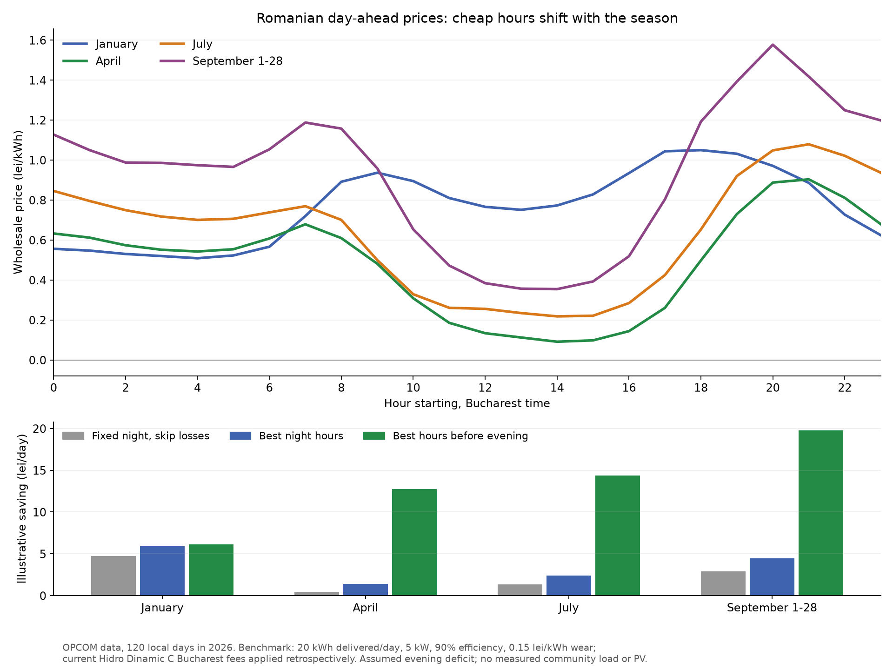
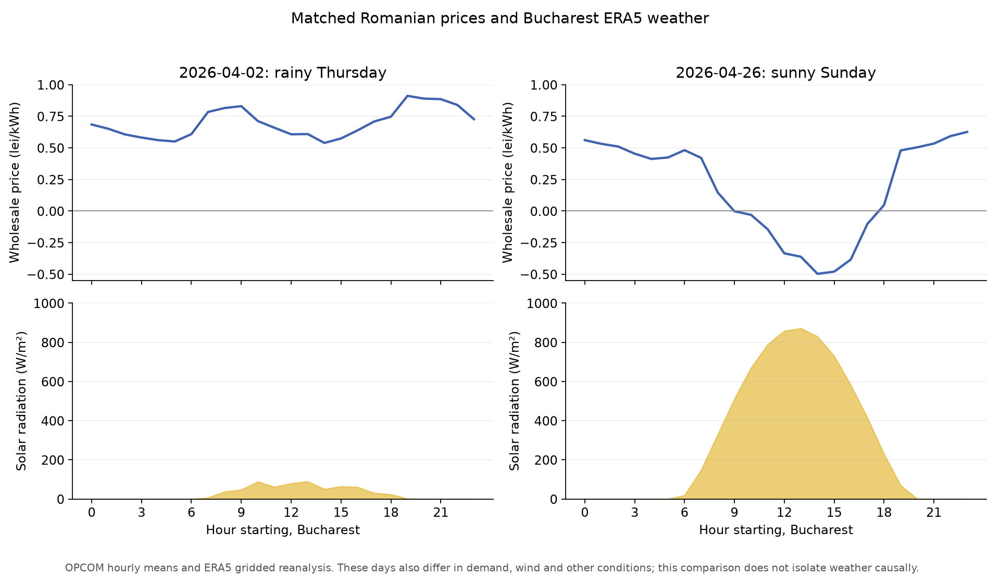

# Romanian battery and EV charging strategy

Research date: 4 October 2026. Location: Bucharest. Requested contract: a price linked to the Romanian day-ahead market.

Implementation update: the application now includes a battery replay and an experimental local/regional-weather price comparison. See [the implementation and export-opportunity analysis](BATTERY_OPTIMISER.md) for its assumptions, results and forecast limitations.

The evidence supports a battery that charges when the full delivered price is low and discharges into expensive, unavoidable demand. An overnight-only rule would miss much of the opportunity in Romania. In the sampled spring, summer and September periods, midday prices were much lower than overnight prices. Winter behaved differently.

For GridLink, the most useful next step is a replay tool that combines real interval prices with measured member imports, exports and solar production. Start with a simple day-ahead schedule, then add weather forecasts and frequent updates. The analysis below provides market evidence and a reproducible price benchmark. It does not establish the financial return of a particular battery or measure savings for the demo community.

## Evidence and scope

I downloaded OPCOM's original 15-minute Romanian day-ahead clearing prices for four seasonal samples: January, April, July, and 1–28 September 2026. The selection contains **120 complete Bucharest calendar days, 11,520 price intervals and 2,880 hourly records paired with weather**. September stops at the 28th to leave enough time for the ERA5 archive to be available when researching on 4 October. These are selected periods, not an annual sample.

Prices come directly from [OPCOM's published day-ahead results and CSV exports](https://www.opcom.ro/grafice-ip-raportPIP-si-volumTranzactionat/ro). OPCOM uses Central European market time and has traded at 15-minute granularity since 1 October 2025. I convert each interval through UTC into Bucharest time; an interval beginning at 00:00 in the market clock begins at 01:00 in Bucharest. The previous market day's last hour is included to reconstruct a complete Romanian calendar day. See [OPCOM's market rules](https://www.opcom.ro/tranzactii-produse/ro/1) and [weekly report explaining the change in granularity](https://opcom.ro/uploads/doc/rapoarte/saptaminal/RSS_2026_15_RO.pdf).

Hourly prices are arithmetic means of four quarter-hour prices, divided by 1,000 to convert lei/MWh into lei/kWh. I cross-checked eight dates against OPCOM's separate hourly export. The largest difference was 0.0075 lei/MWh, or 0.0000075 lei/kWh, consistent with publication rounding. Period means below are time averages, not volume-weighted market prices or consumption-weighted household bills. For example, OPCOM reports a volume-weighted September price of 917.36 lei/MWh; our 1–28 September local-calendar time average is 933.95 lei/MWh. The weighting and coverage differ. [OPCOM's September announcement](https://www.opcom.ro/tranzactii-produse/ro/1).

Historical weather comes from [Open-Meteo's ERA5 archive](https://open-meteo.com/en/docs/historical-weather-api): temperature, global horizontal solar radiation, cloud cover, precipitation and wind at 100 metres. ERA5 combines observations with a physical model. It is historical gridded reanalysis, **not measurements from a rooftop or a Bucharest weather station**. The selected grid cells are Bucharest 44.5°N, 26.0°E; Constanța 44.25°N, 28.5°E; and Tulcea 45.25°N, 28.75°E. The two Dobrogea cells are a regional wind indicator, not a model of all Romanian wind farms. Radiation at timestamp t+1 describes the preceding hour and is paired with the electricity interval starting at t.

I also checked the Romanian meteorological service's station-based seasonal reports, Hidroelectrica's current offer, ANRE's community settlement explanation, and ACER's assessment of Southeast European price spikes. Their findings are cited beside the relevant conclusions.

## What prices actually look like

All periods below use **Bucharest time**. A window 10:00–17:00 contains hours starting at 10:00 through 16:00. Values are wholesale energy prices, excluding supplier charges, network charges and taxes.

| Sample | 00:00–06:00 average | 10:00–17:00 average | 18:00–23:00 average | Days midday was cheaper than night |
|---|---:|---:|---:|---:|
| January, 31 days | 0.531 lei/kWh | 0.823 | 0.933 | 2/31 |
| April, 30 days | 0.578 | 0.154 | 0.766 | 29/30 |
| July, 31 days | 0.752 | 0.258 | 0.945 | 31/31 |
| September 1–28 | 1.015 | 0.448 | 1.366 | 28/28 |

Calculated from the downloaded [OPCOM series](https://www.opcom.ro/grafice-ip-raportPIP-si-volumTranzactionat/ro); the calculations and individual dates are in [daily-benchmark.csv](daily-benchmark.csv).

January's average cheapest hour started at 04:00. April, July and September's average cheapest hour started at 14:00. July's average most expensive hour started at 21:00; September's started at 20:00. Those are descriptive averages, not rules for tomorrow. The complete 24-hour profiles are in the appendix and [hourly-means.csv](hourly-means.csv).



The sampled hourly means included 77 negative-price hours in April, 27 in July and 13 in September. January had none. These counts refer to negative **hourly means**: the underlying 15-minute negative-interval counts were 288, 98 and 53 respectively. Aggregating can change whether an hour is classified as negative.

The data already answers the central scheduling question: spring and summer storage should be allowed to charge in the solar-rich part of the day. An instruction to charge every night can spend money before a much cheaper interval arrives.

## From wholesale prices to an actual Romanian bill

As a concrete domestic-contract reference, I used the current **Hidro Dinamic C, offer DC5-0101-3112-26**, linked from [Hidroelectrica's residential offer page](https://www.hidroelectrica.ro/article/client-casnic). The [published offer PDF](https://cdn.hidroelectrica.ro/cdn/furnizare/2026/30_09/oferta_casnic_dinamic_dc5-0101-3112-26.pdf) prices energy using the customer's consumption-weighted PZU price. It requires an integrated smart meter and estimated annual consumption below 100 MWh. The domestic offer is a tariff reference; a larger or commercial community needs its applicable contract.

Its Bucharest components, before VAT, are:

| Component | lei/kWh |
|---|---:|
| PZU energy | Varies by interval |
| Supply and imbalance component | 0.1250000 |
| Transmission withdrawal, TL | 0.0364500 |
| System services | 0.0127200 |
| Low-voltage distribution | 0.3173900 |
| Green certificates | 0.0740192 |
| CfD contribution | 0.0001440 |
| Cogeneration contribution | 0.0145000 |
| Excise | 0.0076800 |
| Total added to PZU, excluding VAT | **0.5879032** |

The published Bucharest formula is therefore:

```text
R(t) = 1.21 × [PZU(t) in lei/kWh + 0.5879032]
```

The offer treats PZU as already including the generation-side transmission component; do not add TG a second time. The model above holds today's published components constant when replaying historical prices. **It reconstructs costs under the current offer, rather than reproducing historical invoices.** Different applicable charges or VAT treatment require a different formula.

The offer's wording still refers to 24 hourly settlement entries while OPCOM now publishes 96 quarter-hours. I use hourly means for this benchmark and preserve all 15-minute prices for further analysis. Confirm the supplier's actual settlement resolution, clock conversion and treatment of missing meter intervals before implementing billing or claiming additional value from quarter-hour price changes.

At zero wholesale price, this formula still costs approximately **0.711 lei/kWh**. On 26 April at 14:00, the hourly wholesale mean was −0.4968 lei/kWh; the modeled final price was approximately **0.110 lei/kWh**. A negative wholesale price therefore does not automatically mean the household is paid to charge.

For a concrete recent day, 1 September, the following are actual OPCOM hourly prices converted to Bucharest time, with final prices reconstructed using the current offer:

| Bucharest hour | Wholesale lei/kWh | Modeled final lei/kWh |
|---|---:|---:|
| 04:00–05:00 | 0.8554 | 1.7463 |
| 05:00–06:00 | 0.8500 | 1.7399 |
| 11:00–12:00 | 0.6364 | 1.4814 |
| 13:00–14:00 | 0.4196 | 1.2191 |
| 14:00–15:00 | 0.4437 | 1.2482 |
| 18:00–19:00 | 1.2010 | 2.1645 |
| 20:00–21:00 | 1.4889 | 2.5130 |

Sources: [OPCOM's export for market delivery date 1 September](https://www.opcom.ro/rapoarte-pzu-raportPIP-export-csv/01/09/2026/ro?resolution=15), with the market/Bucharest clock conversion described above, and the current supplier offer.

For comparison, the current [PPC Ore Smart+ offer](https://www.ppcenergy.ro/wp-content/uploads/oferta-ppc-ore-smart.pdf) specifies fixed bands: about 1.00 and 1.60 lei/kWh final price in Bucharest. Cheaper periods include nights, weekends and weekday 11:00–15:00 from March through October. It excludes prosumers. Its pricing mechanism differs from the wholesale-linked contract requested here. A product marketed as dynamic must be checked for its actual billing formula.

## Battery economics using those prices

The relevant test is the full marginal import price:

```text
Saving per kWh delivered = avoided import price
                        − charging import price / round-trip efficiency
                        − wear cost per kWh delivered
```

For surplus solar, replace the charging import price with the marginal value of the export or other use that is given up. Solar stored in the battery has an opportunity cost when exporting or allocating it would earn revenue. A prosumer compensation credit can have a different value and timing from the spot price.

Network charges do not cancel completely in grid-charged storage: at 90% efficiency, delivering 20 kWh requires buying 22.22 kWh. The additional 2.22 kWh carries network charges and taxes as well as energy charges.

I compared three policies against the **same assumed 25 kWh evening deficit**, represented by 5 kW of unavoidable consumption from 18:00 to 23:00 each day. This load is a benchmark assumption, not an observation about GridLink's members. Each policy can deliver 20 kWh from storage at a maximum of 5 kW. Charging is also limited to 5 kW. Efficiency is 90%; wear is an assumed 0.15 lei per AC kWh delivered. Each cycle starts and ends at the same state of charge, with no free initial stored energy. There is no PV contribution, EV flexibility, export revenue, standing charge, capital cost, financing cost or standby consumption in this comparison.

Twenty kWh delivered is an energy-service assumption, **not a 20 kWh nameplate battery**. With symmetrical charging/discharging efficiencies of √0.9, the usable DC swing must be about 21.1 kWh, before reserve and depth-of-discharge restrictions.

The policies are:

1. **Fixed overnight:** buy evenly during 00:00–06:00 and discharge evenly during 18:00–23:00.
2. **Choose the best night hours:** select the cheapest overnight charging hours and the most expensive evening discharge hours, respecting the power limit.
3. **Choose the best hours before evening:** select the cheapest hours anywhere in 00:00–18:00, then serve the most expensive evening hours. This permits midday charging. It is a simple restricted policy, not a globally optimal multi-day dispatch model.

Every policy can skip a full cycle if its modeled margin is negative. Prices for the next market delivery day are normally published on the previous day; choosing hours from that published price curve does not require foreknowledge of realized weather. The benchmark does assume its stated load is available.

| Sample | Fixed night, with loss-making cycles skipped | Best night hours | Best hours before evening |
|---|---:|---:|---:|
| January | 4.72 lei/day | 5.91 | **6.11** |
| April | 0.45 | 1.41 | **12.78** |
| July | 1.31 | 2.38 | **14.35** |
| September 1–28 | 2.89 | 4.45 | **19.77** |

These are sample-average operating savings after modeled losses, variable charges, VAT and the assumed wear allowance, **before investment costs**. They compare dispatch policies under a dynamic tariff; they do not establish whether that tariff beats a particular fixed-price contract. The daily calculations are in [daily-benchmark.csv](daily-benchmark.csv), and the assumptions are implemented in [analyse.py](analyse.py).

If the fixed overnight policy runs every day without the profitability check, its average result becomes −1.58 lei/day in April and −1.96 lei/day in July. It has negative full-cycle margins on 21/30 April days and 22/31 July days. Selecting daytime opportunities changes that result substantially.

The best-hours-before-evening policy still has ten negative full-cycle margins in January. It skips them; a more complete model could consider smaller profitable cycles, morning discharge and carrying energy across days. The implementation only evaluates a full 20 kWh service or no service. Its figures are not an upper bound on all possible strategies, and they are not a forecast of actual savings.

The wear allowance needs sensitivity analysis using the battery quote, warranty and expected throughput. For the same 20 kWh cycle, increasing wear from 0.15 to 0.30 lei/kWh reduces the cycle margin by 3 lei. Lower efficiency, constrained demand, a smaller usable battery range, additional grid fees across meters, or inverter derating can reduce the benefit further. Do not annualize these four selected samples into a payback claim.

## How weather changes the market and the schedule

Weather has two separate roles: it affects Romania's system-wide balance and price formation, and it changes the community's own production and demand. Bucharest weather is useful for rooftop solar and local cooling/heating demand; it is insufficient to explain national prices on its own.

### Solar radiation, clouds and seasonal daylight

Mean daily global horizontal irradiation in the paired Bucharest ERA5 data was 1.32 kWh/m² in January, 5.12 in April, 6.31 in July and 4.54 in September 1–28. This is incoming solar energy per horizontal square metre, not PV electricity production per installed kWp. Panel tilt, orientation, shading, snow, module temperature and inverter limits must be included when estimating a roof's output. [JRC PVGIS calculation methods](https://joint-research-centre.ec.europa.eu/photovoltaic-geographical-information-system-pvgis/general-information/data-sources-calculation-methods_en).

There is substantial variation within a season:

| Date | Bucharest daily irradiation | Midday wholesale mean, 10:00–17:00 | Evening mean, 18:00–23:00 | Practical implication |
|---|---:|---:|---:|---|
| 2 April, rainy Thursday | 0.65 kWh/m² | 0.620 lei/kWh | 0.855 | A weak local solar day; overnight and midday prices were similar. |
| 26 April, sunny Sunday | 7.06 | −0.318 | 0.432 | Large daytime opportunity; preserve space for PV and cheap grid energy. |
| 22 July, rainy Wednesday | 2.00 | 0.322 | 0.832 | Less local PV, but midday imports were still much cheaper than night. |
| 30 July, sunny Thursday | 7.30 | 0.219 | 1.153 | Strong solar resource and a substantial evening price difference. |
| 13 September, rainy Sunday | 1.70 | 0.463 | 1.153 | Local cloud does not automatically eliminate the midday market discount. |

Calculated from the downloaded [OPCOM data](https://www.opcom.ro/grafice-ip-raportPIP-si-volumTranzactionat/ro) and [ERA5 archive](https://open-meteo.com/en/docs/historical-weather-api). These comparisons do not isolate weather's causal price effect. Weekends, regional renewable output, imports, demand and plant availability also differ.



For operation, forecast the *surplus after local demand and planned EV charging*, not total solar production. On a sunny forecast, avoid filling the stationary battery overnight if cheap midday energy or local surplus is likely. On a cloudy forecast, calculate a greater grid-charging requirement, then obtain it in the cheapest feasible published intervals. Keep adjusting when actual PV diverges from the forecast.

### Wind, particularly in Dobrogea

Strong regional wind can provide cheap energy outside daylight hours. A solar-only schedule would miss some of those intervals. The sampled mean of the two Dobrogea 100 m wind indicators was 6.11 m/s in January, 5.23 in April, 4.36 in July and 4.82 in September. These are weather indicators, not measured wind generation or turbine capacity factors.

For a later price forecast, use spatial wind forecasts with actual national generation and availability data. A turbine power curve is nonlinear and includes cut-in, rated and cut-out behavior; doubling wind speed does not imply doubling generated electricity. For dispatch after day-ahead prices are available, the published price curve already captures the market's expectations about wind. Weather helps forecast our own balance and periods beyond the published price horizon.

The system data source should be [Transelectrica's production, consumption and exchange history](https://www.transelectrica.ro/en/widget/web/tel/sen-grafic/-/SENGrafic_WAR_SENGraficportlet). Its graph identifies instantaneous values; do not treat a point sample as interval-average generation without checking the underlying dataset. This research does not claim to have fitted a national generation/price model.

### Heat, cooling demand and the evening solar decline

On 1 September, Bucharest ERA5 temperature reached about 31.9°C while solar radiation fell toward sunset. The wholesale hourly price was about 0.420 lei/kWh at 13:00 and 1.489 at 20:00. That is an observed price/weather pairing, not proof that temperature alone caused the difference.

Heat can increase air-conditioning demand and keep demand elevated after PV declines. Hotter modules also produce less power than a simple irradiance-only estimate would suggest. JRC's model explicitly includes module temperature and wind cooling. The controller should therefore forecast cooling load and actual PV performance, while preserving energy for the expensive post-sunset period.

[ACER's 2026 assessment of Southeast Europe](https://www.acer.europa.eu/monitoring/MMR/crosszonal-electricity-trade-capacities-2026) attributes the region's 2024 spikes primarily to insufficient flexibility replacing solar in high-demand evenings, together with constrained cross-border capacity. It identifies persistent regional price differences into early 2026. This supports testing evening storage and demand shifting, while accounting for import constraints.

ANM reports that summer 2026 had heatwaves affecting about 91.6% of Romania, with a maximum duration of 15 consecutive days, and national precipitation 15.3% below the reference median. Its July report describes mixed regional conditions; July should not be represented as uniformly hot across the country. [ANM summer 2026](https://www.meteoromania.ro/clim/caracterizare-sezoniera/cc_JJA_2026.html), [ANM July 2026](https://www.meteoromania.ro/clim/caracterizare-lunara/cc_2026_07.html).

### Drought, hydro production and cooling water

Rainfall and river levels have effects over weeks and months, beyond tomorrow's rooftop PV. Hydroelectrica reports first-half 2026 net production 17% above first-half 2025, associated particularly with improved first-quarter hydrology; the first-quarter Danube flow was 13% higher. That demonstrates why a general assumption of always-low hydro output would also be wrong. [Hidroelectrica first-half 2026 report](https://bvb.ro/infocont/infocont26/H2O_20260811190800_H2O-RO-S1-2026-Sinteza.pdf).

Later in the summer, low water levels affected nuclear availability. On 30 July, SNN confirmed Unit 2 remained connected while Unit 1 awaited sufficient Danube levels. On 13 August, SNN announced the controlled shutdown of Unit 2 because the Danube level continued to fall. These are direct links between hydrological conditions and generation availability. [SNN 30 July report](https://nuclearelectrica.ro/ir/wp-content/uploads/sites/3/2026/07/RC-SNN_raport-curent-Unitatea-2-CNE-Cernavoda-ramane-conectata-la-SEN-bvb.pdf), [SNN 13 August report](https://nuclearelectrica.ro/ir/wp-content/uploads/sites/3/2026/08/RC-Oprire-controlata-U2.pdf).

The operating response is to monitor hydrological outlooks and confirmed plant availability, then let published prices and forecast deficits determine purchases. A small community battery shifts energy over hours; it cannot cover a multi-day national supply shortage. Do not assume that overnight power will be cheap during a prolonged shortage.

### Winter cold, short days and reserves

The January ERA5 series reached −13.0°C in the selected Bucharest grid cell. On 20 January, it ranged from −9.4 to 1.4°C, with 2.37 kWh/m² of irradiation. The evening wholesale window averaged 1.493 lei/kWh, versus 0.606 overnight. This illustrates a winter overnight-charging opportunity, with limited solar energy available relative to summer.

Forecast weather-sensitive heating loads from the actual buildings. Use battery and charger temperature limits from their manufacturers, and keep the intended backup reserve. The economic scheduler must respect the real usable capacity and power limits, rather than assuming rated performance in every condition.

## Options for GridLink

| Option | How it works | Advantages | Main limitation |
|---|---|---|---|
| Seasonal rules with a profitability gate | Winter defaults to cheap overnight windows; other sampled seasons allow midday charging; cycles need a positive full-cost margin. | Easy to explain, quick to implement, useful reference policy. | Misses unusual weather, cheap wind periods and day-specific price shapes. |
| Day-ahead prices plus demand prediction | Select purchases from the published curve to cover expected expensive residual demand, within battery and connection limits. | Captures the main price opportunity demonstrated here. | Depends on a useful demand forecast and accurate tariff/meter data. |
| Day-ahead prices plus local solar/weather prediction | Forecast PV surplus and temperature-sensitive demand; preserve battery space for PV and avoid unnecessary grid charging. | Improves the choice of charging source and target state of charge. | Forecast errors can leave insufficient energy or unused capacity. |
| Rolling schedule with uncertainty | Re-plan every 15 minutes as demand, PV, battery state and forecasts change; compare normal, low-solar and high-demand cases. | Responds to cloud movement, cooling load and missed predictions. | More implementation work; price and power limits still bound the savings. |
| EV and stationary battery coordination | Schedule EVs directly into cheap available intervals; use stationary storage for inflexible demand or vehicles arriving after cheap intervals. | Avoids an additional storage cycle when direct charging is feasible. | Must respect departures, connection times, charger limits and shared connection capacity. |
| Battery size and placement comparison | Replay the same baseline for several kWh/kW sizes and for individual-meter versus shared installations. | Tests whether storage is worth installing and where it helps most. | Requires installed-cost quotes, actual settlement rules and enough seasonal load data. |

My implementation recommendation is **day-ahead prices plus predicted residual demand**, followed by solar forecasting and a rolling update. Keep seasonal rules as a reference and fallback. Prices for tomorrow are normally already available after the auction; an initial version does not need a machine-learning model to predict them. [OPCOM's normal publication schedule](https://www.opcom.ro/tranzactii-produse/ro/1).

Weather-aware targets should be calculated from expected energy and constraints. For example, a sunny day's target can leave room for forecast PV surplus; a cold/cloudy day can purchase more grid energy for the expected expensive deficit. Avoid hard-coding a universal target such as charging to 100% nightly.

A stationary battery is needed to move energy from an earlier cheap interval into *inflexible* later consumption. EV charging can be optimized without a separate stationary battery when the vehicle is connected during cheaper intervals: charge its own battery then. Both costs must be compared at the same energy boundary, including charger efficiency. Feeding an EV through a stationary battery adds another conversion/storage stage.

## Collecting a baseline without first buying a battery

Use historical interval readings if available; there is no reason to wait several weeks merely to reconstruct already-recorded consumption. If history is unavailable, collect new data while running normally. Begin with approximately 4–8 weeks for an initial household demand model, then expand across heating and cooling seasons before making an investment decision. This is a proposed sampling plan, not a statistically guaranteed minimum.

For each metered connection, record import/export kWh, production or inverter readings where available, EV availability and charging energy, timestamps and applicable tariff components. A meter's net import already reflects self-consumption; do not subtract PV production from it again. Build the residual demand after the allocation that the real settlement arrangement permits.

Replay identical demand and solar sequences under no battery, overnight rules, day-ahead scheduling, weather-aware scheduling and EV coordination. An observed aggregate grid-import profile is useful, but the optimizer should respond to predicted *cost and volume* rather than treating historical import hours as permanently fixed. New weather and new EV behavior change those hours.

If a battery is already present, a counterfactual baseline can be reconstructed using its measured charge/discharge flows and losses. That avoids needing to disable it purely for the experiment. Validate the energy balance at the meter.

Every replay should keep equal starting and ending state of charge, preserve the backup reserve, limit power and grid connection capacity, account for wear and export credits, and distinguish kW from kWh. Compare cost, peak import, total imports, losses, throughput and any unmet EV target. Import kWh can rise while cost falls because storage losses require additional purchases.

For weather-aware validation, use the forecast that was available when the schedule would have been made, not ERA5 weather from the future. Reanalysis is appropriate for the descriptive analysis here; using it as a perfect operational forecast would overstate performance. [Open-Meteo's forecast archive options](https://open-meteo.com/en/docs/historical-forecast-api) and [single forecast runs](https://open-meteo.com/en/docs/single-runs-api) can support a later replay with forecast issuance times preserved.

## Transport split, shared batteries and the existing prototype

The existing adjustable 50/50 split is a community accounting choice. It does not set the regulated transmission or distribution tariff. The actual published import tariff includes both, plus other charges. Changing the split can redistribute member gains; it does not by itself reduce the community's external energy bill.

The numerical battery comparison assumes the battery offsets demand **behind the same billed meter**. A battery exporting into the public network for consumption at another member's meter needs the corresponding allocation and billing model. Do not count it as tariff-free behind-the-meter consumption merely because both people belong to GridLink.

Legal-status correction, checked 5 October 2026: ANRE's June explanation described proposed community billing arrangements. ANRE published a third consultation draft on 2 October, with comments due on 16 October. Its allocation and billing provisions must therefore be treated as proposals. The draft envisages distributor-validated interval allocations, residual or single suppliers and network charges on measured consumption; it proposes distribution IT implementation by 31 December 2026, with allocated-energy billing starting when those systems become functional. Community registration and the adopted wholesale/storage rules do not prove that settlement is available for our proposed installation. [ANRE's latest consultation](https://anre.ro/proiect-de-ordin-pentru-modificarea-si-completarea-regulamentului-de-furnizare-a-energiei-electrice-la-clientii-finali-aprobat-prin-ordinul-presedintelui-autoritatii-nationale-de-reglementare-in-dom-4/) and [draft order](https://anre.ro/wp-content/uploads/2026/10/Proiect-de-ordin-pentru-modificarea-Regulamentului-de-furnizare.docx). See [the PV-farm and apartment-building feasibility study](PV_FARMS_AND_APARTMENTS.md) for adopted rules, producer eligibility and supplier-mediated alternatives.

For a future prototype extension, introduce tariff values per interval and per connection; use Romanian lei consistently or an explicit dated currency conversion. Keep the existing 0.60 pricing weight separate from the changing energy tariff. Keep network components and the internal fee allocation separate to avoid charging them twice. Preserve the battery's source of stored energy, charging cost and losses in its ledger, and report total community savings separately from member-to-member payments.

The current application still uses estimated constant loads and a global solar-yield factor. The data and scripts in this research folder do not turn it into a live dynamic-price scheduler. The next development step is a local import-and-replay screen that lets us compare policies and assumptions before sending any battery or EV commands.

## Hourly wholesale price appendix

Each row is an hour starting in Bucharest time. Values are sample averages in lei/kWh, rounded to three decimals. Source: downloaded OPCOM 15-minute prices; methodology above.

| Start hour | January | April | July | September 1–28 |
|---|---:|---:|---:|---:|
| 00:00 | 0.556 | 0.633 | 0.846 | 1.127 |
| 01:00 | 0.547 | 0.612 | 0.795 | 1.050 |
| 02:00 | 0.530 | 0.574 | 0.749 | 0.988 |
| 03:00 | 0.520 | 0.551 | 0.717 | 0.986 |
| 04:00 | 0.509 | 0.543 | 0.701 | 0.974 |
| 05:00 | 0.523 | 0.554 | 0.706 | 0.966 |
| 06:00 | 0.567 | 0.608 | 0.738 | 1.054 |
| 07:00 | 0.720 | 0.679 | 0.769 | 1.188 |
| 08:00 | 0.892 | 0.610 | 0.701 | 1.158 |
| 09:00 | 0.937 | 0.482 | 0.500 | 0.959 |
| 10:00 | 0.895 | 0.309 | 0.329 | 0.654 |
| 11:00 | 0.810 | 0.186 | 0.261 | 0.472 |
| 12:00 | 0.766 | 0.134 | 0.256 | 0.384 |
| 13:00 | 0.751 | 0.112 | 0.235 | 0.357 |
| 14:00 | 0.773 | 0.091 | 0.218 | 0.354 |
| 15:00 | 0.828 | 0.098 | 0.221 | 0.393 |
| 16:00 | 0.935 | 0.144 | 0.285 | 0.519 |
| 17:00 | 1.044 | 0.261 | 0.425 | 0.804 |
| 18:00 | 1.050 | 0.498 | 0.653 | 1.192 |
| 19:00 | 1.032 | 0.730 | 0.920 | 1.393 |
| 20:00 | 0.971 | 0.888 | 1.048 | 1.577 |
| 21:00 | 0.886 | 0.904 | 1.079 | 1.418 |
| 22:00 | 0.727 | 0.811 | 1.022 | 1.250 |
| 23:00 | 0.624 | 0.680 | 0.937 | 1.199 |

## Reproducing the calculations

For the subsequent replay using public measured household consumption, including bill reductions, profitable-day rates and conditional battery ROI, see [CONSUMER_BACKTEST.md](CONSUMER_BACKTEST.md). The original benchmark below uses assumed demand; the measured-consumption analysis is a separate experiment.

Files in this folder:

- [prices-15min.csv](prices-15min.csv): 11,520 native price intervals, UTC and Bucharest timestamps, market interval numbers and source URLs.
- [hourly-prices-weather.csv](hourly-prices-weather.csv): 2,880 hourly prices with matched weather for the three locations.
- [hourly-means.csv](hourly-means.csv): the unrounded 24-hour seasonal profiles.
- [daily-benchmark.csv](daily-benchmark.csv): daily windows, weather, margins and selected charging hours.
- [summary.json](summary.json) and [metadata.json](metadata.json): results and provenance.
- [collect_data.py](collect_data.py) and [analyse.py](analyse.py): download/validation and calculation scripts. Raw downloaded files are cached locally in `raw/`, which is excluded from Git.

Use a separate research environment if preferred; these packages are not added to the application's dependency files. With the existing local Python environment:

```powershell
.\.tools\uv\uv.exe pip install --python .\.tools\venv\Scripts\python.exe -r research\romania\requirements.txt
.\.tools\venv\Scripts\python.exe research\romania\collect_data.py
.\.tools\venv\Scripts\python.exe research\romania\analyse.py
```

Collection needs internet access. The calculation script runs from saved data. ERA5/Open-Meteo attribution: historical weather data from Copernicus ERA5 distributed by Open-Meteo under its stated CC BY 4.0 terms. Electricity price source: OPCOM. Monetary results in this report are our own calculations using the stated tariff and benchmark assumptions.
